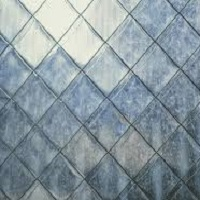
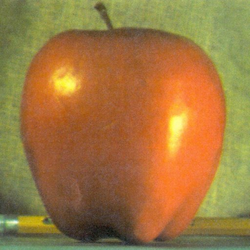
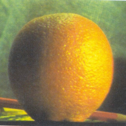
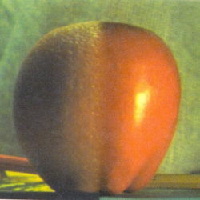

Laplacian Blend
==============

This is a simple Matlab script that blends two images using Laplacian Pyramid Blending.

# Sources of inspiration

This script is created as an example solution to the Lab 3.1 of the **[Robotics: Vision Intelligence and Machine Learning](https://www.edx.org/course/robotics-vision-intelligence-machine-pennx-robo2x)** course available on **[edex.org](https://edex.org/)**.

# How to Run

To Run the script you will need any MATLAB version which can run functions like imread, imshow and imfilter.
To use the script open the Matlab and specify the path to the folder containing the script.
Now you can either run the blending.m script or run the following code in the Matlab Comand Window:

```
img1 = imread('img/img1.png');
img2 = imread('img/img2.png');

lap = lapblend(img1, img2, 50, 5);
```
The lapblend function takes as input two images (loaded using imread function), percentage value that specifies the proportion between blending images (50 -> 1/2, 25 -> 1/4 90 - 9/10 etc.) and pyramid depth.
As a result, it outputs the blended images and shows them as a figure. 


# Examples 

Some of the blends achieved with this script:

| Img1 | Img2 | Result|
|:-:|:-:|:-:|
|  |  | |
|  | | |
